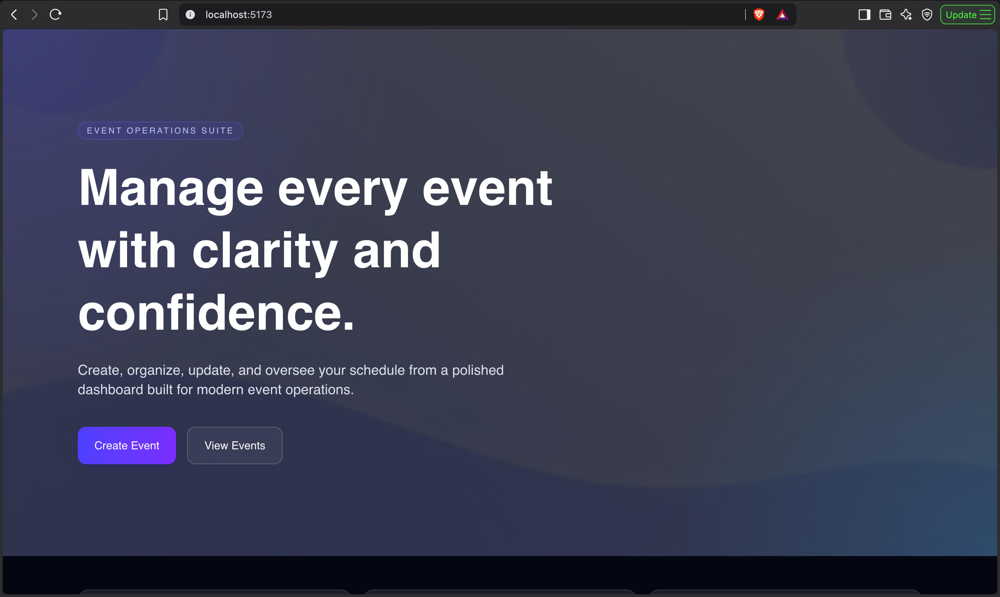
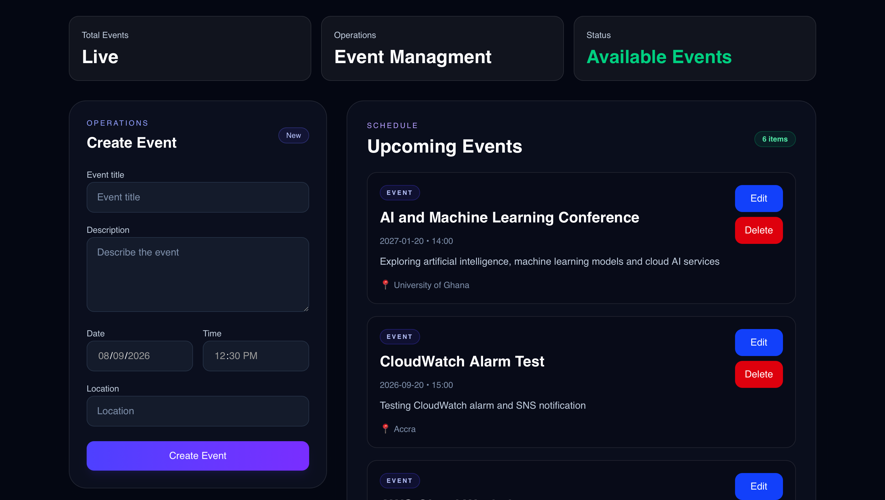
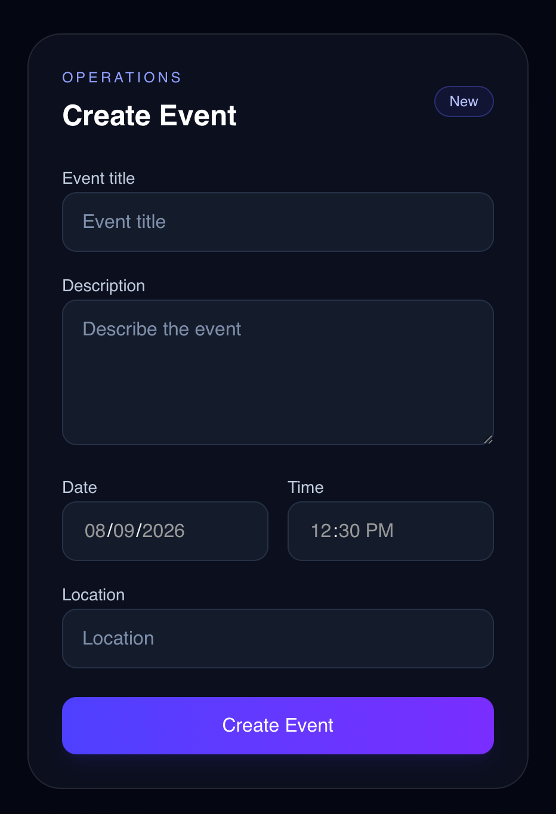
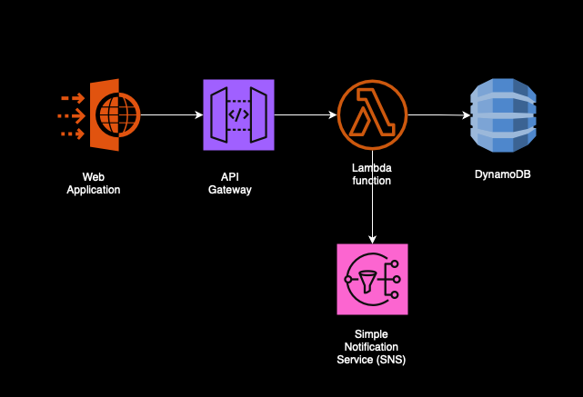

# Event Management Platform

A full-stack event management platform for administrators to create, view, update, and delete events. The project combines a React dashboard with a serverless AWS backend managed through Terraform.

> Replace the image placeholders below with screenshots from your deployed application before showcasing the project.

## Showcase

### Landing page

<!-- Add a screenshot at: docs/images/landing-page.png -->


### Events dashboard

<!-- Add a screenshot at: docs/images/events-dashboard.png -->


### Create or edit event form

<!-- Add a screenshot at: docs/images/event-form.png -->


### Deployed AWS infrastructure

<!-- Add a diagram or AWS Console screenshot at: docs/images/aws-architecture.png -->


## Features

- Create events with a title, description, date, time, and location.
- View all stored events.
- Update event details.
- Delete events that are no longer needed.
- Invoke a serverless REST API from the React dashboard.
- Receive SNS notifications when a new event is created.
- Monitor Lambda errors with CloudWatch alarms.
- Manage infrastructure as code using Terraform.

## Architecture

```text
React + Vite dashboard
        |
        v
Amazon API Gateway (HTTP API)
        |
        v
AWS Lambda functions ─────────► Amazon SNS notifications
        |
        v
Amazon DynamoDB events table

CloudWatch monitors Lambda errors and sends alarms to SNS.
```

Terraform provisions the API Gateway, Lambda functions, DynamoDB table, IAM permissions, SNS topic, and CloudWatch alarms.

## Technology stack

| Area | Technology |
| --- | --- |
| Frontend | React 19, Vite, Tailwind CSS |
| Backend | Python 3.12, AWS Lambda |
| API | Amazon API Gateway HTTP API |
| Data | Amazon DynamoDB |
| Notifications and monitoring | Amazon SNS, Amazon CloudWatch |
| Infrastructure | Terraform |

## Project structure

```text
.
├── lambda/                  # Python Lambda handlers
├── src/                     # React application
│   └── components/          # Dashboard UI components
├── public/                  # Static frontend assets
└── terraform/
    ├── env/dev/             # Development environment entry point
    └── modules/             # Reusable AWS infrastructure modules
        ├── api_gateway/
        ├── cloudwatch/
        ├── dynamodb/
        ├── iam/
        ├── lambda/
        └── sns/
```

## Run the frontend locally

### Prerequisites

- Node.js 20 or later
- npm

### Installation

```bash
npm install
npm run dev
```

Vite will print the local application URL, usually `http://localhost:5173`.

To create a production frontend build:

```bash
npm run build
```

## Deploy the AWS infrastructure

### Prerequisites

- Terraform 1.10 or later
- An AWS account and AWS CLI credentials with permission to create the configured resources
- An S3 bucket named `fcp-terraform-state` in `us-east-1` for Terraform state, or an updated backend configuration in `terraform/env/dev/backend.tf`

### Configure development values

Review `terraform/env/dev/terraform.tfvars` before deploying. Important values include:

```hcl
aws_region     = "us-east-1"
environment    = "dev"
project_name   = "event-management-platform"
allowed_origin = "*" # Set this to your frontend domain in production.
```

### Initialize, review, and apply

```bash
cd terraform/env/dev
terraform init
terraform validate
terraform plan
terraform apply
```

After deployment, retrieve the API URL:

```bash
terraform output -raw api_gateway_url
```

Set the frontend's API configuration to this URL before using the deployed dashboard.

## CI/CD

GitHub Actions runs the following checks on every pull request and push to `main`:

- Installs, lints, and builds the React frontend.
- Compiles the Python Lambda handlers.
- Checks Terraform formatting and validates the development configuration without accessing remote state.

After a successful push to `main`, the workflow plans and deploys the development infrastructure. Deployment is protected by the GitHub `development` environment, so configure required reviewers there before enabling the workflow for a shared repository.

### Required GitHub configuration

Create a GitHub environment named `development`, then add the following values to that environment:

| Type | Name | Purpose |
| --- | --- | --- |
| Secret | `AWS_ROLE_TO_ASSUME` | ARN of an AWS IAM role trusted by GitHub Actions through OpenID Connect (OIDC). |
| Variable | `AWS_REGION` | AWS region for deployment; defaults to `us-east-1` when omitted. |

The IAM role must have access to the Terraform state bucket and permission to manage the resources in this stack. The workflow deliberately uses OIDC rather than long-lived AWS access keys.

### Destroy the development environment

Run this only when you no longer need the deployed development resources:

```bash
terraform destroy
```

## API endpoints

The HTTP API exposes the following routes:

| Method | Path | Description |
| --- | --- | --- |
| `POST` | `/events` | Create an event |
| `GET` | `/events` | List all events |
| `GET` | `/events/{id}` | Get one event |
| `PUT` | `/events/{id}` | Update an event |
| `DELETE` | `/events/{id}` | Delete an event |

Example request:

```bash
curl -X POST "$API_URL/events" \
  -H "Content-Type: application/json" \
  -d '{
    "title": "Product Launch",
    "description": "Launch event for the new product.",
    "date": "2026-10-15",
    "time": "18:00",
    "location": "Accra"
  }'
```

## Production considerations

- Replace the development CORS wildcard with the exact production frontend domain.
- Use separate Terraform environments and remote state for development, staging, and production.
- Subscribe an approved email endpoint, webhook, or incident-management service to the SNS topic.
- Apply least-privilege IAM policies and review them periodically.
- Enable AWS budgets and billing alarms before production use.
- Store application configuration and secrets in AWS Systems Manager Parameter Store or AWS Secrets Manager; never commit them to the repository.
- Consider DynamoDB backups, retention policies, and API Gateway access logging for operational workloads.

## Troubleshooting

| Issue | Resolution |
| --- | --- |
| `terraform init` cannot access the state bucket | Confirm the bucket exists, its region matches the backend configuration, and your AWS credentials can access it. |
| Browser requests fail with CORS errors | Set `allowed_origin` to the precise frontend URL and run `terraform apply` again. |
| Lambda cannot access DynamoDB | Confirm the Terraform deployment completed and inspect the Lambda execution role and CloudWatch logs. |
| API URL is missing | Run `terraform output -raw api_gateway_url` from `terraform/env/dev`. |

## Author

Dennis Peprah

